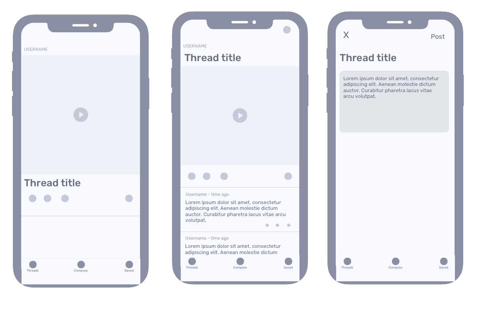

# Product requirements document (PRD)

> ## *Hades*

### What is Your App Vision Statement?
To create a clean and tidy Reddit interface that of which resembles Instagram. Users shall be able to filter subreddits and create their own “multireddit”, to view content from those subreddits only.

### Create a List of Features
> The first version of your mobile app needs to offer a simple and intuitive user experience. Choosing features for your mobile app is a planning process that requires you to define the product vision, objectives, and themes fully. Some standard features can include:
>  * Sign-up and login
>  * Splash screen
>  * Navigation
> * Image galleries
> * Forms

### Product & Technical Specifications
> Product and technical specifications outline the systemic and functional needs to meet for the product to achieve the desired features and functionalities.
> 
> 
> Determine the following within the product/technical specifications for your mobile app requirements document:
> * What operating system versions should support it?
iOS 13
> * What are your current services, servers, databases?
Reddit services
> * Do you have current API/services documentation?
Yes, Reddit API

> * Are there other credentials that are needed or already exist (analytics systems, or platforms)?
OAuth2 token

### Dependencies
> Dependencies are any aspect that the product or product team relies on to meet objectives.
> These may include:
   * Service/API documentation
       - [Reddit API](https://www.reddit.com/dev/api/)
   * Profile/account/platform credentials
       - Reddit account
   * Any third-party software your app relies on
       - Reddit

### Milestones
> Insert milestones here
* Log in
* Show posts
    - with current upvotes, comment count, post age
* View comments
* Post
* up/downvote
* Search for subreddit
* Filter by subreddit

### Wireframes  

